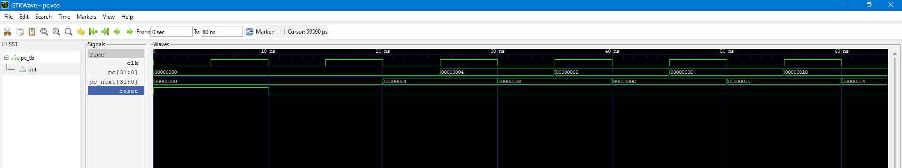
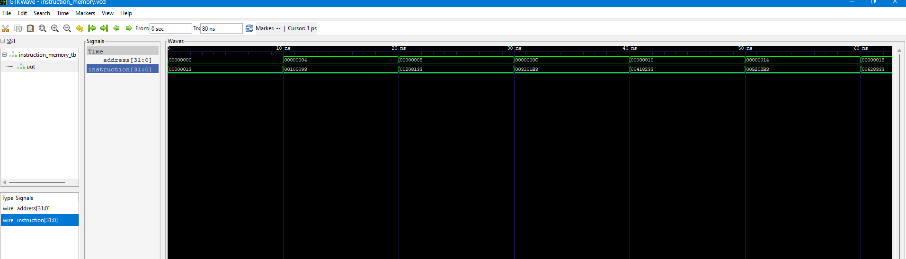
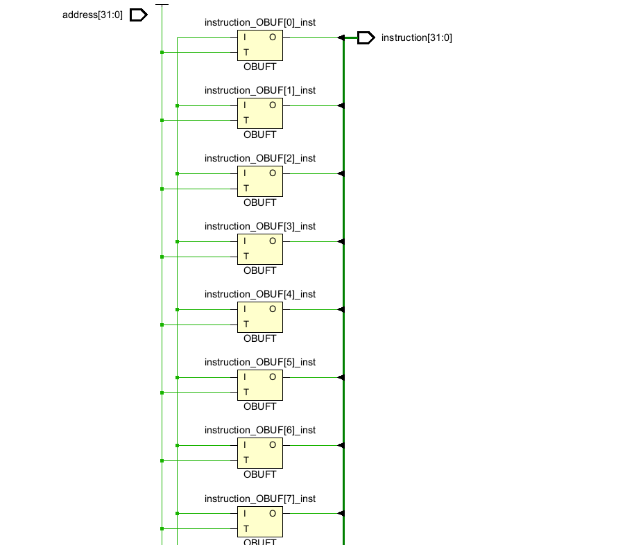
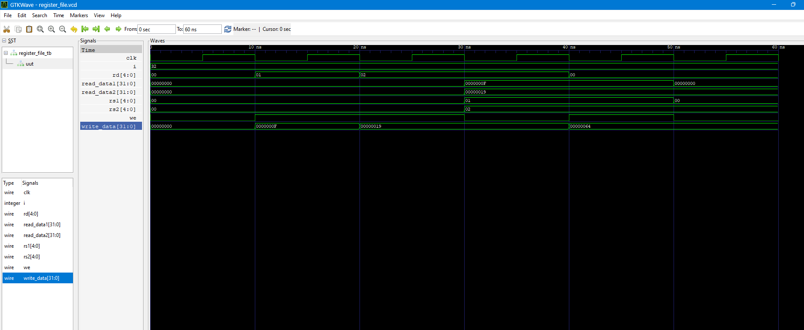
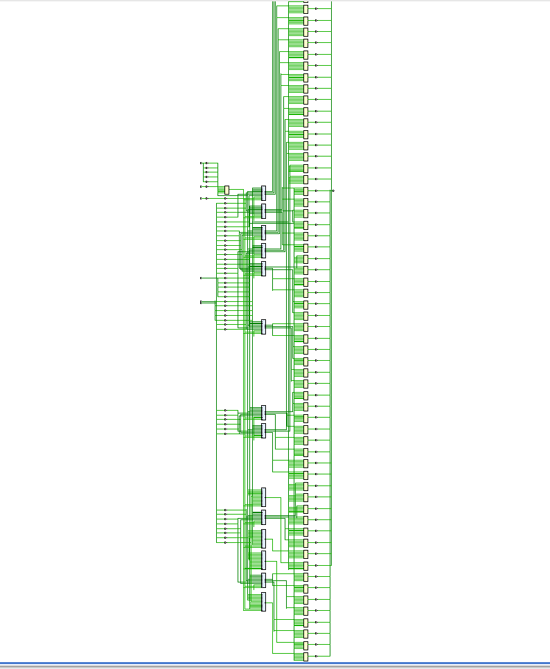

# Design and Verification of a 32-bit 5-Stage Pipelined RISC-V (RV32I) Processor using Verilog HDL

A complete implementation of a **32-bit 5-stage pipelined RISC-V (RV32I) Processor** in **Verilog HDL**, including RTL design, functional verification, waveform analysis, synthesis, and documentation.

---

# Project Overview

This project aims to design and verify a complete 32-bit pipelined RISC-V processor from scratch following the standard RV32I ISA.

The processor is being developed module-by-module, verified individually, synthesized using AMD Vivado, and version-controlled using Git and GitHub.

---

# Development Flow

- RTL Design using Verilog HDL
- Functional Verification using Icarus Verilog
- Waveform Analysis using GTKWave
- RTL Synthesis using AMD Vivado
- Version Control using Git & GitHub
- Documentation using Markdown

---

# Processor Pipeline

```
Instruction Fetch (IF)
        │
        ▼
Instruction Decode (ID)
        │
        ▼
Execute (EX)
        │
        ▼
Memory Access (MEM)
        │
        ▼
Write Back (WB)
```

---

# Pipeline Stage Progress

| Pipeline Stage | Status |
|----------------|--------|
| Instruction Fetch (IF) | ✅ Completed |
| Instruction Decode (ID) | 🔄 In Progress |
| Execute (EX) | ⏳ Pending |
| Memory Access (MEM) | ⏳ Pending |
| Write Back (WB) | ⏳ Pending |

---

# Modules

| Module | Status |
|---------|--------|
| Program Counter (PC) | ✅ Completed |
| Instruction Memory | ✅ Completed |
| Register File | ✅ Completed |
| Immediate Generator | ⏳ Pending |
| Main Control Unit | ⏳ Pending |
| ALU Control Unit | ⏳ Pending |
| Arithmetic Logic Unit (ALU) | ⏳ Pending |
| Branch Comparator | ⏳ Pending |
| Data Memory | ⏳ Pending |
| IF/ID Pipeline Register | ⏳ Pending |
| ID/EX Pipeline Register | ⏳ Pending |
| EX/MEM Pipeline Register | ⏳ Pending |
| MEM/WB Pipeline Register | ⏳ Pending |
| Hazard Detection Unit | ⏳ Pending |
| Forwarding Unit | ⏳ Pending |
| Top-Level Processor | ⏳ Pending |

---

# Current Project Structure

```text
riscv-32bit-pipelined-processor
│
├── RTL
│   ├── IF
│   │   ├── pc.v
│   │   └── instruction_memory.v
│   │
│   ├── ID
│   │   └── register_file.v
│   │
│   ├── EX
│   ├── MEM
│   ├── WB
│   ├── Pipeline
│   ├── Hazard
│   └── Branch
│
├── Testbench
│   ├── pc_tb.v
│   ├── instruction_memory_tb.v
│   └── register_file_tb.v
│
├── Memory
│   └── program.mem
│
├── images
│   ├── pc_waveform.png
│   ├── instruction_memory_waveform.png
│   ├── instruction_memory_rtl.png
│   ├── register_file_waveform.png
│   └── register_file_rtl.png
│
├── Reports
│
├── README.md
├── LICENSE
└── .gitignore
```

---

# Module Verification

## 1. Program Counter (PC)

### GTKWave



---

## 2. Instruction Memory

### GTKWave



### RTL Schematic (Vivado)



---

## 3. Register File

### GTKWave



### RTL Schematic (Vivado)



---

# Tools Used

- Verilog HDL
- Icarus Verilog
- GTKWave
- AMD Vivado ML Edition 2025.1
- Visual Studio Code
- Git
- GitHub

---

# Features Implemented

- 32-bit Program Counter
- 64 × 32-bit Instruction Memory
- 32 × 32-bit Register File
- Two Asynchronous Read Ports
- One Synchronous Write Port
- x0 Register Hardwired to Zero
- Functional Verification using Testbenches
- Waveform Verification using GTKWave
- RTL Synthesis using Vivado

---

# Development Progress

| Day | Work | Status |
|-----|------|--------|
| Day 1 | GitHub Repository, Project Setup, Folder Structure | ✅ |
| Day 2 | Program Counter (PC) | ✅ |
| Day 3 | Instruction Memory | ✅ |
| Day 4 | Register File | ✅ |
| Day 5 | Immediate Generator & Main Control Unit | ⏳ |
| Day 6 | ALU Control & ALU | ⏳ |
| Day 7 | Pipeline Registers | ⏳ |
| Day 8 | Data Memory | ⏳ |
| Day 9 | Hazard Detection & Forwarding Unit | ⏳ |
| Day 10 | Top-Level Integration & Complete Processor | ⏳ |

---

# Future Improvements

- Complete RV32I Instruction Set
- Branch Prediction
- Pipeline Hazard Resolution
- Data Forwarding
- FPGA Implementation
- Timing Analysis
- Performance Evaluation

---

# Author

**Arun Undrajavarapu**

B.Tech - Electronics and Communication Engineering

Sardar Vallabhbhai National Institute of Technology (SVNIT), Surat

---

# License

This project is released under the **MIT License**.

---

**This repository documents my complete journey of designing, verifying, synthesizing, and integrating a 32-bit 5-stage pipelined RISC-V (RV32I) processor from scratch using Verilog HDL.**